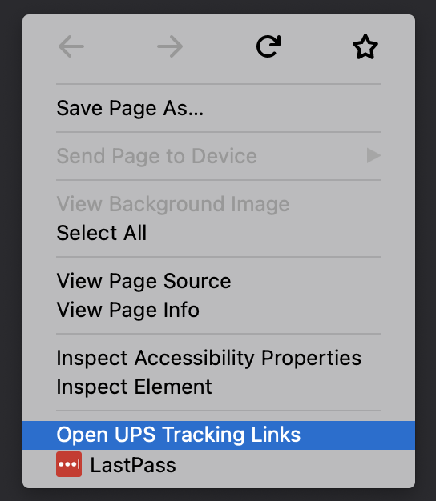

### UPS MyChoice Link Bypass Extension 
------------
 

UPS changed the URL format for tracking links in its MyChoice email notifications recently. Now they take you to an overview page behind a login wall. This extension adds a context menu option that allows you to open the tracking links on a page to the non-logged in version directly.

